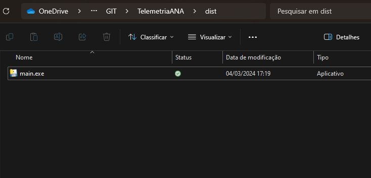
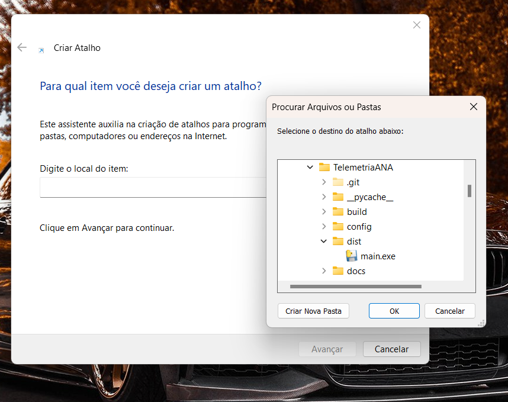
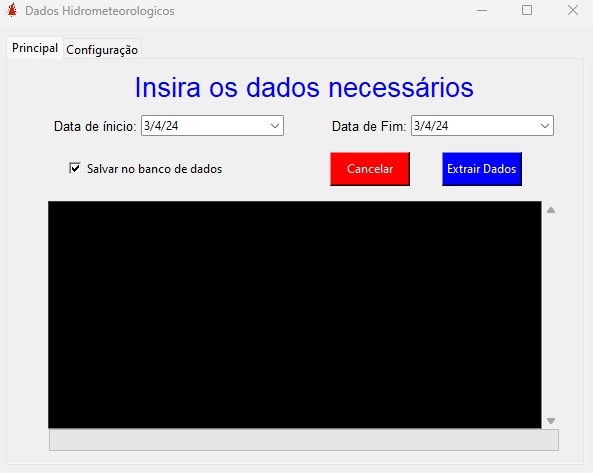
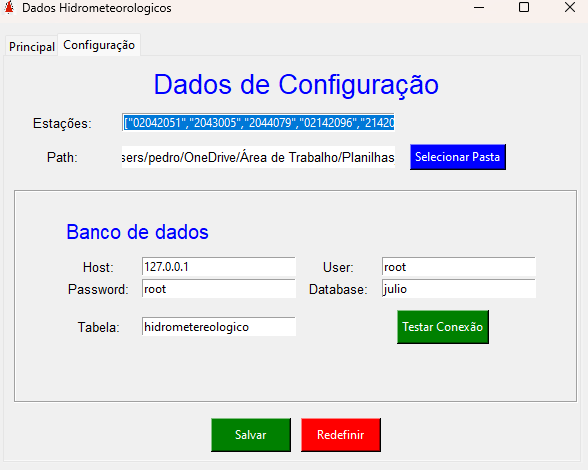
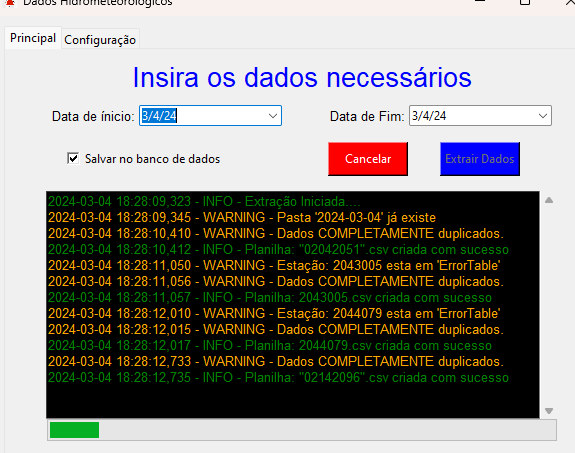
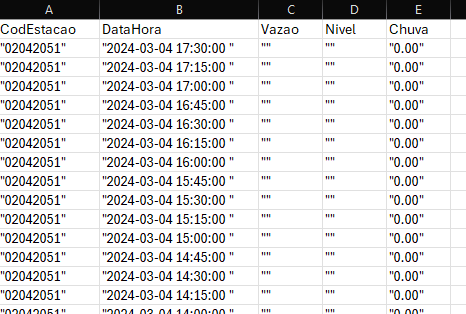
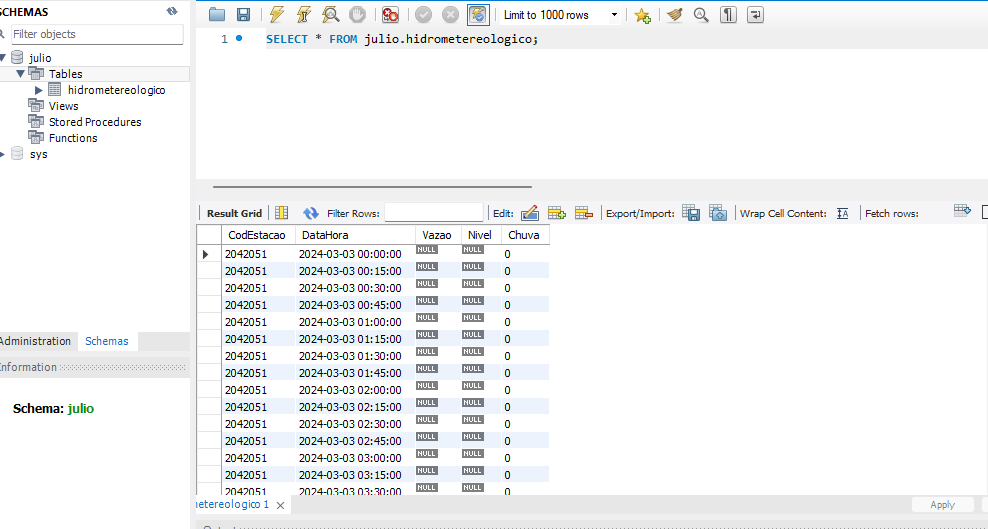

# Telemetria ANA.GOV.BR

Este projeto tem como base simplificar a captação e tratamento de dados das Estações de Monitoramento da Agência Nacional de Águas e Saneamento Básico (ANA). É um código em Python que faz a requisição de dados via GET no http://telemetriaws1.ana.gov.br/ e realiza o tratamento, além de armazenar os dados em planilhas em Excel e no banco de dados MySQL.

## Instalação

Para executar o projeto, siga estas instruções de instalação:

1. **Instalar Python**:
   Certifique-se de ter o Python instalado em seu sistema. Você pode baixar a versão estável mais recente do Python [aqui](https://www.python.org/downloads/).

2. **Instalar o gerenciador de pacotes PIP**:
   O PIP é o gerenciador de pacotes padrão do Python. Execute o seguinte comando em seu terminal ou prompt de comando:

   ```
   python get-pip.py
   ```

3. **Instalar bibliotecas necessárias**:
Execute o seguinte comando para instalar as bibliotecas necessárias:

    ```
    pip install datetime numpy pandas mysql-connector-python tkcalendar logging pyinstaller
    ```

    Este comando instalará as seguintes bibliotecas:
    - datetime
    - numpy
    - pandas
    - mysql-connector-python
    - tkcalendar
    - logging
    - pyinstaller

    Estas bibliotecas são essenciais para:
    - Manipulação de dados
    - Conexão com banco de dados
    - Criação de interfaces gráficas
    - Geração de logs no projeto

    Certifique-se de que todas as bibliotecas estejam corretamente instaladas antes de executar o código.

## Execução do Programa

Para executar o programa, basta navegar até a pasta `dist` dentro do projeto e executar o arquivo `main.exe`. Você também pode criar um atalho para o executável .exe na Área de Trabalho e executar o algoritmo normalmente.



### Criação de Atalho para Execução do Programa




## Telas do Programa

O programa possui duas telas: a de extração e tratamento de dados, e a de configurações para a execução do programa.

### Tela Principal

Na tela principal, realizamos a busca dos dados das estações no URL http://telemetriaws1.ana.gov.br/, usando as datas de início e fim no formato americano `mês/dia/ano`.

Para salvar os dados em um banco de dados MySQL, basta deixar a opção `Salvar no banco de dados` marcada (padrão) e clicar no botão `Extrair`. Se desejar interromper antes de concluir a extração, clique no botão `Cancelar`.




### Tela de Configurações

Na tela de configurações, parametrizamos dados importantes da aplicação:

- **Estações**: São os códigos das estações que serão buscadas pela aplicação. Formato: `["Código da Estação", "Código da Estação", "Código da Estação", ...]`.

- **Path**: Caminho no qual será criada a pasta (Nome: `ano-mes-dia`) que receberá as planilhas com os dados das estações.

- **Campos de Configuração do Banco de Dados**: Aqui, configuramos os campos de acesso ao banco de dados. O usuário preencherá os campos de `Host`, `User`, `Password`, `Database`, e `Tabela`. Caso o usuário não tenha criado a tabela, a aplicação criará automaticamente e inserirá os dados.

- **Botões**: 
    - `Testar Conexão`: Verifica se as configurações do banco de dados permitem comunicação com o banco de dados.
    - `Salvar`: Salva e atualiza as configurações editadas na tela de configurações.
    - `Redefinir`: Limpa todos os campos.

Tela:



## Mensagens/Logs

Na tela principal, há uma área rolável que exibirá os logs/mensagens do processamento dos dados. Existem três tipos de logs:

- **INFO**: Apresenta mensagens informativas sobre a execução do algoritmo, destacadas em verde.

- **WARNING**: Exibe mensagens sobre alguma execução de dados que requer atenção do usuário, mas não são erros. Essas mensagens são destacadas em amarelo.

- **ERROR**: Apresenta erros da aplicação, como por exemplo, falhas ao comunicar com o banco de dados. Essas mensagens são destacadas em vermelho.

Mensagens de Warning importantes:

- **Pasta 'yyyy-mm-dd' já existe**: Indica que a pasta na qual as planilhas serão incluídas já existe, portanto, as planilhas duplicadas serão sobreescritas.

- **Dados PARCIALMENTE duplicados**: Indica que existem dados de alguma estação naquele determinado dia e horário que já foram incluídos no banco de dados. No entanto, os dados que não estão duplicados serão inseridos normalmente.

- **Dados COMPLETAMENTE duplicados**: Significa que os dados de alguma estação naquele determinado dia e horário já foram inseridos anteriormente no banco de dados e estão duplicados. Nesse caso, os dados duplicados não serão inseridos novamente.

- **Estação: codigo_da_estação esta em 'ErrorTable'**: Indica que a estação não apresentou nenhum dado no XML do http://telemetriaws1.ana.gov.br/ (requisição). Nesse caso, os dados serão inseridos como nulos e com um intervalo de monitoramento de 15 em 15 minutos, da data de início à final, tanto no banco de dados quanto para a planilha.

Tela com Logs:



## Tela do Console

Ao executar o programa em formato .exe, uma tela de console/prompt será aberta inicialmente. Não feche esta janela enquanto o programa estiver em execução. Após fechar a janela do programa, você pode fechar a tela do console normalmente.

## Resultados da Aplicação:

**Planilhas**:



**Banco de dados**:

